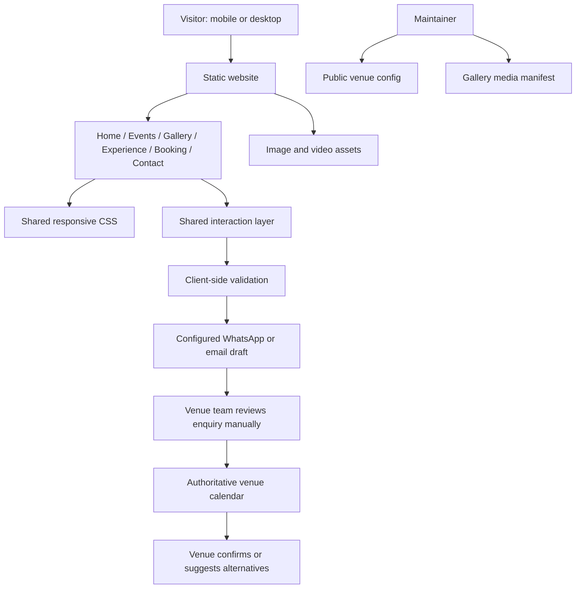
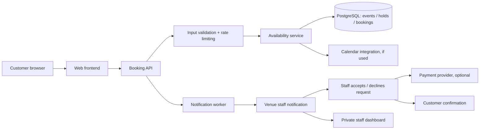

# System Architecture

## Current release scope
A multi-page static website hosted as files (GitHub Pages, Vercel static output, or another static host). It uses shared CSS and JavaScript, a small configuration file for public contact details, and a media manifest. It has no server, admin panel, calendar source, persistence or payment gateway today.

## Component diagram

## Recommended production booking architecture (next phase)

## Proposed data entities
- `availability_blocks`: id, starts_at, ends_at, status, reason (private), created_at.
- `enquiries`: id, name, phone, email, event_type, event_date, guest_range, setup_preference, budget_range, notes, consent, status, created_at.
- `booking_holds`: id, enquiry_id, starts_at, expires_at, status. Holds need an expiry policy and transactional conflict checking.
- `bookings`: id, enquiry_id, starts_at, ends_at, guest_count, status, quoted_amount, confirmed_at.
- `venue_settings`: event categories, verified capacity, business contact, timezone and booking policy.
- `audit_log`: actor, action, entity, timestamp, metadata (avoid copying sensitive personal data into logs).

Store timestamps consistently, display in Asia/Kolkata, validate event windows on server, and use database transactions or an exclusion constraint to prevent overlapping confirmed bookings. Client-side calendar state is never authoritative.

## Security and privacy requirements
- Do not ship API secrets, database credentials or admin credentials to browser JavaScript.
- Server-side validation, request throttling, spam protection, secure secret management and database least privilege.
- Obtain consent before marketing communications; collect only needed data and publish a privacy notice / retention policy.
- Escape any user-provided notes in admin views; protect admin routes with real authentication and authorization.
- Make payment integration PCI-conscious by using a reputable hosted checkout; never store card details directly.
- Backups, error monitoring, uptime checks, dependency updates and documented incident response before launch.

## Deployment and asset guidance
- Use semantic multi-page HTML as the accessible and dependency-light current build.
- Keep shared styles/scripts under `assets/`; photos in `assets/images/`; MP4 files in `assets/videos/`.
- Optimise photos as WebP/AVIF where practical, preserve source originals offline, set width/height and descriptive alt text, use lazy loading below the fold.
- Use poster images and `preload=metadata` for video; never autoplay audio.
- Configure `assets/js/config.js` with verified public business contact data only.
- Add CI that checks internal links, referenced local assets and JavaScript syntax.
- Choose one canonical deployment root. A static website cannot serve as a confirmed availability database on its own.
