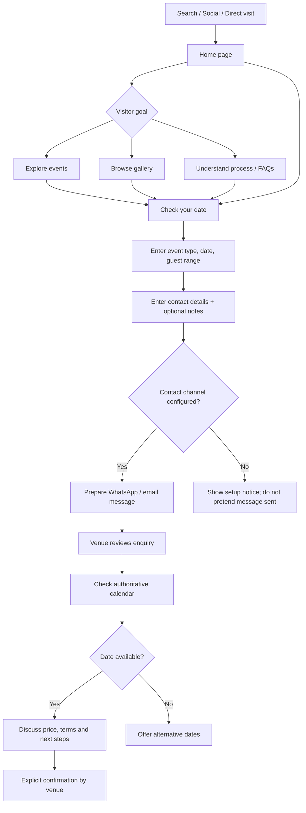
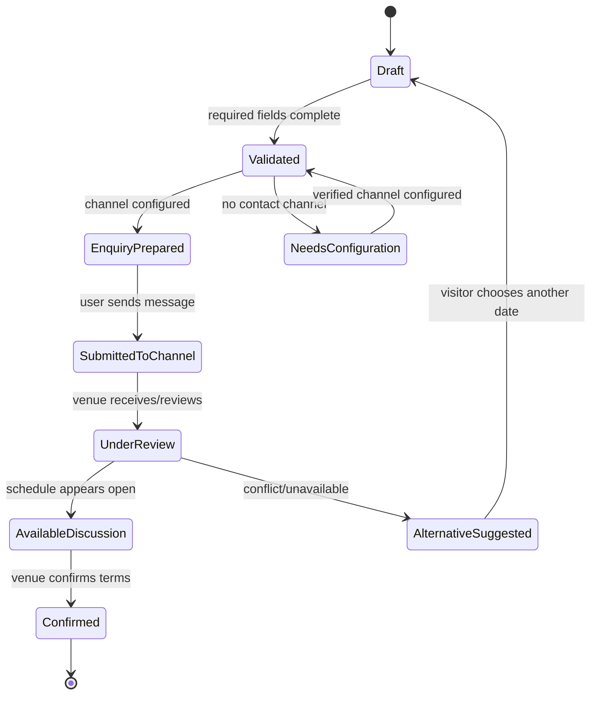

# User Experience Flows

## Main site navigation

## Booking interaction state model

## Booking page fields
Required: customer name, phone, event type, preferred event date and expected guest range. Optional: email, budget range, preferred reply channel and notes. Date must not be in the past in the user's local timezone. Server-side revalidation remains mandatory when a booking API is introduced.

## Critical copy distinction
- **Check your date**: starts an enquiry, does not check a live calendar in the current static build.
- **Enquiry prepared**: a draft is ready for a configured communication channel.
- **Enquiry sent**: only after the user sends it through the selected channel or a server confirms receipt.
- **Booking confirmed**: only after the venue has verified availability and explicitly accepted the booking.
