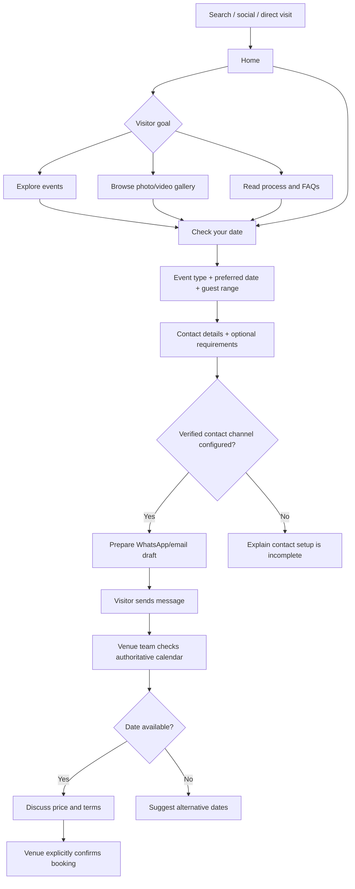
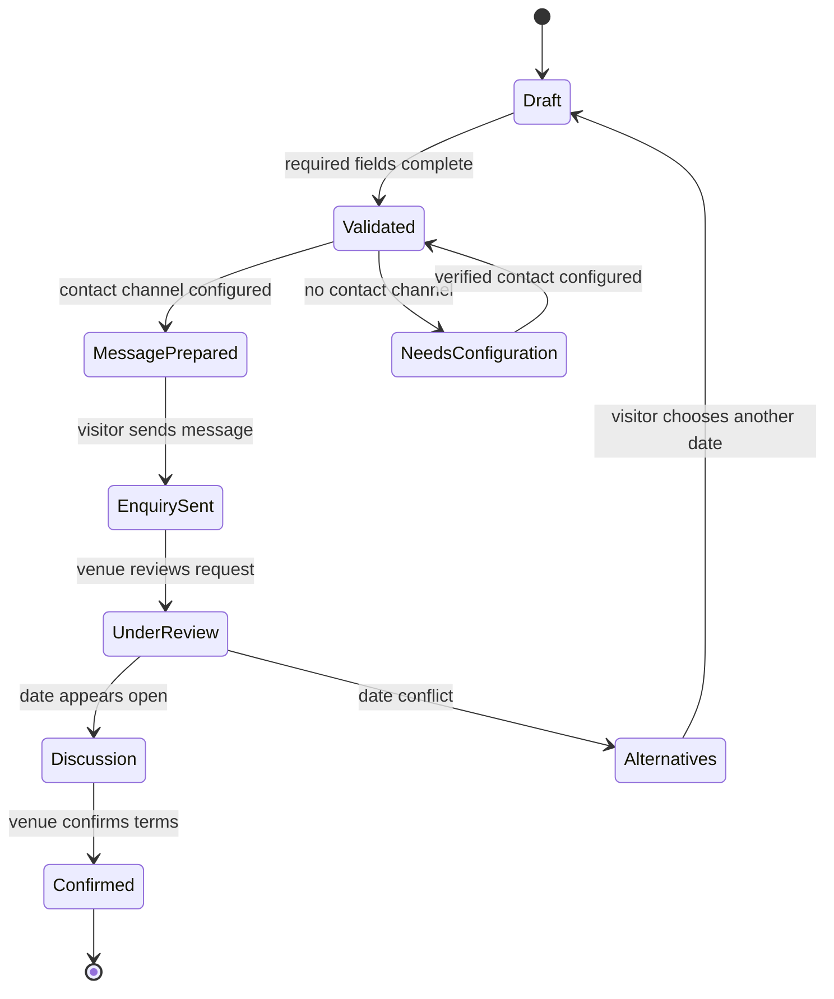

# User Experience Flows

## Main visitor journey

## Enquiry state model

## Terminology
- “Check your date” starts an enquiry; the static build does not query a live calendar.
- “Message prepared” does not mean the message was delivered.
- “Booking confirmed” is only after the venue checks its calendar and explicitly accepts.

Required booking fields are name, phone, event type, date and guest range. Email, budget and notes are optional. Client-side validation is not a substitute for server-side validation when a booking API is introduced.
